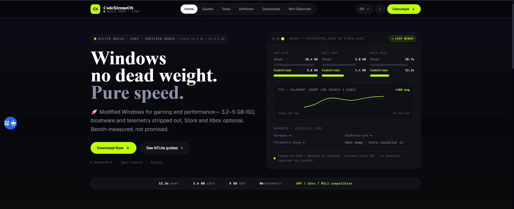

# CodeXtreme Website 🌐

[](https://opensource.org/licenses/MIT)
[](https://astro.build)
[](https://tailwindcss.com)

Official **CodeXtreme** website - Informative web created by **XOscarDevX**. Open source project built with Astro and Tailwind CSS for maximum efficiency and performance.

[](https://www.codextreme.es)

## Project Purpose

This repository contains the complete source code of the CodeXtremeOS website, designed to:

- Present the operating system features
- Provide technical documentation
- Offer updates and news
- Show screenshots and demonstrations
- Provide guides and tools

## Technical Features

✨ **Modern Interface**
Clean and professional design with accessibility first

📱 **Responsive Design**
Perfect adaptation for mobile, tablets, and desktop

🎨 **Theme System**
Built-in support for light/dark mode

🔍 **Advanced SEO**
Dynamic meta tags and automated sitemap

🌐 **Internationalization**
Built-in support for multiple languages (English/Spanish)

⚡ **Performance Optimized**
Static site generation with optimal loading speeds

🛠️ **Developer Experience**
Hot reload, TypeScript support, and modern tooling

## Tech Stack

- **Astro** v7.3.2 - Next-generation static framework
- **React** v19.2.6 - UI library for interactive components
- **Tailwind CSS** v4.3.0 - Modern CSS utilities framework (CSS-first config)
- **TypeScript** - Type-safe development (strict mode)
- **Heroicons** v2.2.0 - Beautiful hand-crafted SVG icons
- **Prism.js** v1.30.0 - Syntax highlighting for code blocks

### Additional Tools & Plugins

- **@astrojs/react** v6.0.5 - React integration for Astro
- **@astrojs/sitemap** v3.7.4 - Sitemap generation with i18n support
- **@tailwindcss/vite** v4.3.0 - Tailwind CSS v4 Vite plugin
- **Vite** v7.3.5 - Build tool and dev server

## Project Architecture

```
src/
├── components/          # Reusable Astro components
├── data/                # Tweak definitions (network, GPU, memory, ...)
├── i18n/                # Internationalization utilities
├── layouts/             # Page layouts
├── pages/               # Route pages (en/es)
└── styles/              # Tailwind v4 CSS-first theme

public/                  # Static assets (images, icons, _headers, _redirects)
scripts/                 # Helper scripts
```

### Key Configuration Files

- `astro.config.mjs` - Astro configuration (React, Sitemap, Tailwind Vite plugin, i18n)
- `src/styles/tailwind.css` - Tailwind v4 CSS-first theme (`@theme` tokens)
- `pnpm-workspace.yaml` - pnpm settings and security `overrides` for transitive CVEs
- `tsconfig.json` - TypeScript configuration (extends `astro/tsconfigs/strict`)

## Local Development

Prerequisites:

- **Node.js** v22.12.0 or higher (see `.nvmrc`)
- **pnpm** v12.3.4 (pinned via `packageManager` in `package.json`)

Installation steps:

1. **Clone repository:**

```bash
git clone https://github.com/CodeF1ow/codextreme-web.git
cd codextreme-web
```

2. **Install dependencies:**

```bash
pnpm install
```

3. **Start development server:**

```bash
pnpm run dev
```

The site will be available at `http://localhost:4321/`

4. **Build for production:**

```bash
pnpm run build
```

### Additional Commands

- `pnpm run start` - Alternative command to start development server
- `pnpm run preview` - Preview production build locally (after build)

## ⭐ Support the Project

If you like this project, you can support it in the following ways:

- **⭐ Star the Repository**: Give this project a star on GitHub to help others discover it
- **☕ Buy me a Coffee**: Support development with a small donation via [PayPal](https://paypal.me/botarctic)

Your support helps me continue creating awesome projects like this one! 🚀

## License

This project is open source under the MIT license.

## Support and Contact

Questions or suggestions?

[Discord FireMoss](https://discord.gg/6weESehnXA)

[CodeXtreme Team](contact@kiridev.me)

**Twitter:** @CodeF1ow

---
